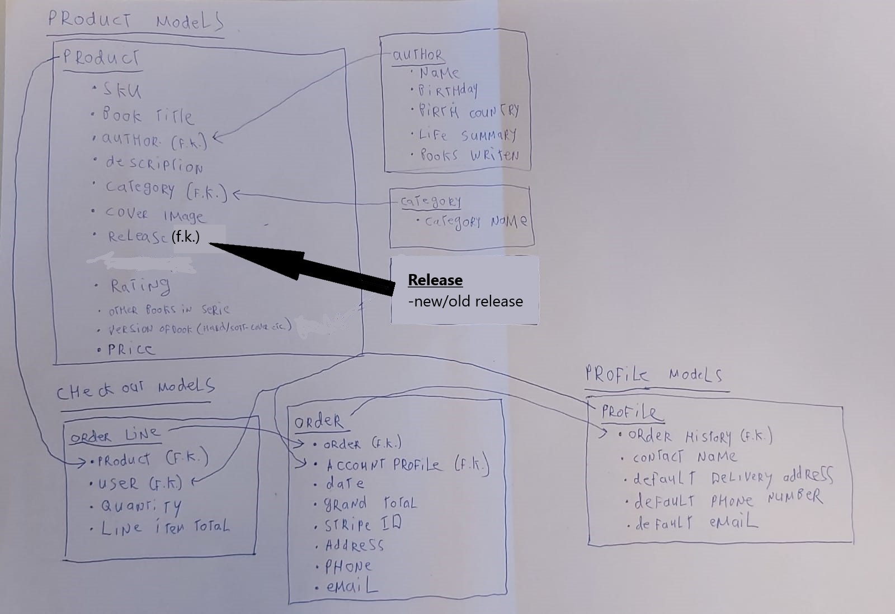

# The Bookstore Holland

- [UX](#ux)
  - [Project Goal](#project-goal)
  - [User Stories](#user-stories)
    - [User Stories for Customers](#user-stories-for-customers)
    - [User Stories for Shop Administrators](#user-stories-for-shop-administrators)
  - [Wireframes](#wireframes)
  - [Data Structure](#data-structure)
  - [Design](#design)
    - [Typography](#typography)
    - [Colors](#colors)
- [Features](#features)
  - [Existing Features](#existing-features)
  - [Features Left to implement](#features-left-to-implement)
- [Testing](#testing)
- [Deployment](#deployment)
  - [Local Deployment](#local-deployment)
  - [Deployment to Heroku](#deployment-to-heroku)
- [Technologies](#technologies)
- [Tools Used](#tools-used)
- [Credits](#credits)
  - [Media](#media)
  - [Acknowledgements](#acknowledgements)

---

The Bookshop is a website designed to light out some of the best books made in the previous 40 years. 

The site will be deployed to Heroku and can then be viewed [here]().

## UX

### Project Goal

This project is my fourth and final Milestone Project in the Code Institute's Fullstack Development program. The purpose of this project was to create an e-commerce site using the Django framework, static file hosting with AWS, and a functional payment system with Stripe. This e-commerce site is fully functional and could be used by a real beer distribution company with minimal setup.

### User Stories

#### User Stories for Customers


| **As a customer I would like to**                  | **So that I can**                                    |
| -------------------------------------------------- | -----------------------------------------------------|
| Browse through books                               | purchase what I need                                 |
| Search for books                                   | find something specific                              |
| Filter books by category                           | compare the offerings                                |
| Filter books by price                              | compare the offerings                                |
| Filter books by author                             | compare the offerings                                |
| See books of a specific author                     | compare the offerings                                |
| Buy a book                                         | serve it to customers                                |
| Pay using a card                                   | complete my purchase                                 |
| Create a profile                                   | save my information and review past orders           |
| Update my profile information                      | so the delivery will be send to the righ address     |                  |
| See my shopping cart before paying                 | know the cost and content before the purchase        |
| Update my shopping cart                            | make decisions before the purchase                   |
| See details about a product                        | make an informed purchasing decision                 |
| View my order history                              | be reminded of previous purchases                    |
| Receive an email confirmation about my order       | have archived information about it                   |
| Contact the website                                | get in touch if there are problems wirh the delivery |

#### User Stories for Shop Administrators

| **As an administrator I would like to**     | **So that I can**                                |
| ------------------------------------------- | ------------------------------------------------ |
| Add/Update/Remove a book                    | keep the store up to date                        |
| Add/Update/Remove a author                  | keep users informed about the latest information |
| Add/Update/Remove a category                | create a more diversified offer                  |
| Highlight specific books                    | sell books that need to move                     |
| Receive orders from customers in my mailbox | fulfill the orders                               |
| Mark a book as a new arrival                | entice customers with fresh products             |

### Wireframes

Following these user stories, wireframes were drawn to provide a starting point and guidance throughout the development process.

*this is the place where the wireframe will be in the future*

### Data Structure

Before starting the development of the application, its models and their relationships were delineated:



### Design

The application was built using bootstrap and its responsive grid system.
Fonts and colors were carefully chosen to give the application a distinctive brand and feel.

#### Typography


#### Colors

## Features

### Existing Features

### Features Left to implement

## Testing


## Deployment


### Local Deployment

These are the steps to deploy Beer WareHaus locally.

1.  From the application's [repository](https://github.com/waterrot/The-Bookstore), click the "code" button and download the zip of the repository.

    Alternatively, you can clone the repository using the following line in your terminal:

        git clone https://github.com/waterrot/The-Bookstore.git

2.  Access the folder in your terminal window and install the application's required modules using the following command:

        python -m pip -r requirements.txt

3.  Create a file containing your environmental variables called `env.py` at the root level of the application. It will need to contain the following lines and variables:

    ```
    import os
    (the import code line will come here)
    ```

    Please note that you will need to update the `SECRET_KEY` with your own secret key, as well as the Untappd and strip keys and secret variables with those provided by those applications.

    If you plan on pushing this application to a public repository, ensure that `env.py` is added to your `.gitignore` file to protect your secrets.

4.  The application can now be run locally. In your terminal, type the command `python3 manage.py runserver`. The application will be available in your browser at the address `http://localhost:8000`.

### Deployment to Heroku


## Technologies

-   HTML
-   CSS
-   JavaScript / jQuery
-   Python
-   Django

## Tools Used

-   Github
-   Heroku
-   [Google Fonts](https://fonts.google.com/)
-   [Font Awesome](https://fontawesome.com/)

## Credits

### Media

### Acknowledgements

-   This site is meant for educational use.
-   [Felipe Alarcon](https://github.com/fandressouza) for his helpful feedback and advice, and constant availability as a mentor
-   [Beer Warehause](https://github.com/jumboduck/beer-warehaus) for the basic structure of the README file.
-   Many thanks to the team at the Code Institute for their help throughout the development process.